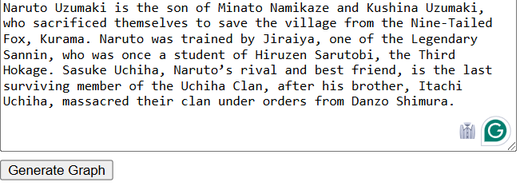
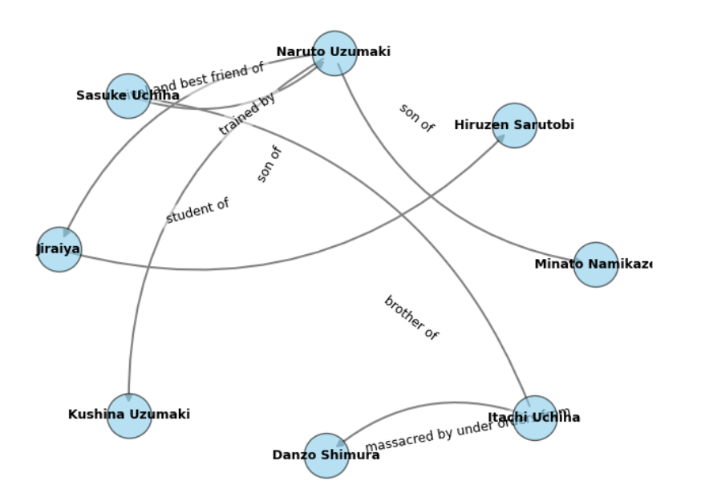

# **GenGraph Visualizer**

## **Overview**
Gen Graph Visualizer is a simple **Named Entity Recognition (NER) and Relationship Extraction** tool that converts input text into an interactive **graph visualization**. It extracts entities and their relationships using **Perplexity AI's API** and displays them as a network graph.




## **Features**
- Extracts **entities** and **relationships** from text using **NER techniques**.
- Generates a **graph visualization** with labeled nodes and edges.
- **Curved edges with labels close to relationships** for better readability.
- **Automatic layout adjustments** to avoid overlapping edges and improve aesthetics.
- Simple **web-based UI** with a text input field and a graph display.

## **How It Works**
1. **Input a text paragraph** related to an anime (e.g., Naruto) or any other domain.
2. The system extracts **entities (characters, places, objects)** and **relationships (connections between them)**.
3. A **graph is generated** where:
   - **Nodes** represent entities.
   - **Edges** represent relationships.
   - **Labels** describe the nature of relationships.
4. The graph is centered with properly spaced nodes for clarity.

## **Technologies Used**
- **Python** (for backend processing)
- **NetworkX** (for graph generation)
- **Matplotlib** (for graph rendering)
- **Flask** (for serving the UI)
- **HTML, CSS, JavaScript** (for the frontend)
- **Perplexity AI API** (for NER extraction)

## **Installation & Usage**
### **1. Clone the Repository**
```sh
git clone https://github.com/Shiva-017/GenGraph.git
cd GenGraph
```
### **2. Add .env file with the perplexity API key

### **3. Install Dependencies**
```sh
pip install -r requirements.txt
```

### **4. Run the Application**
```sh
python app.py
```

### **5. Open in Browser**
Navigate to:
```
http://localhost:5000
```
Enter a text paragraph and visualize the entity relationship graph!

## **Example Output**
### **Input Text:**
```
Naruto Uzumaki is the son of Minato Namikaze. Sasuke Uchiha is Naruto's rival.
Jiraiya mentored Naruto and was a student of Hiruzen Sarutobi.
```

### **Extracted Entities & Relationships:**
```json
{
    "entities": [
        "Naruto Uzumaki", "Minato Namikaze", "Sasuke Uchiha", "Jiraiya", "Hiruzen Sarutobi"
    ],
    "relationships": [
        {"source": "Naruto Uzumaki", "relationship": "son of", "target": "Minato Namikaze"},
        {"source": "Naruto Uzumaki", "relationship": "rival of", "target": "Sasuke Uchiha"},
        {"source": "Jiraiya", "relationship": "mentor of", "target": "Naruto Uzumaki"},
        {"source": "Jiraiya", "relationship": "student of", "target": "Hiruzen Sarutobi"}
    ]
}
```

### **Graph Visualization:**
- **Nodes:** Represent anime characters.
- **Edges:** Represent relationships.
- **Curved edges with labels** close to the lines.

## **Future Improvements**
- Add **interactive graph** visualization using D3.js.
- Support for **multiple relationship types** (e.g., friends, teacher-student, enemy).
- Improve **graph aesthetics** further (colors, animations, better spacing).

## **Contributing**
Feel free to submit pull requests or raise issues to improve this project!


